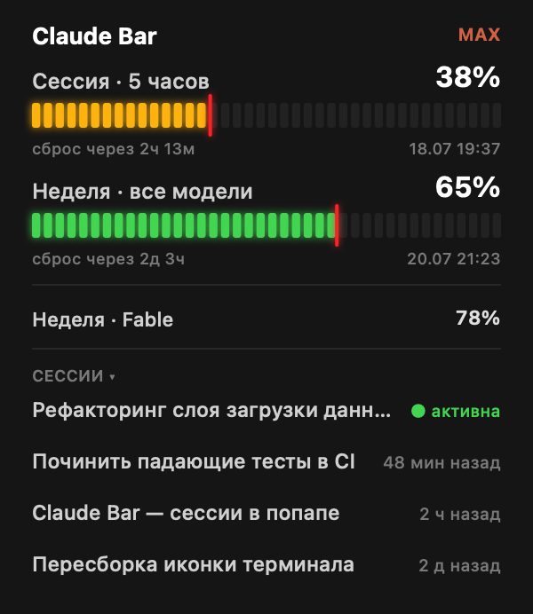
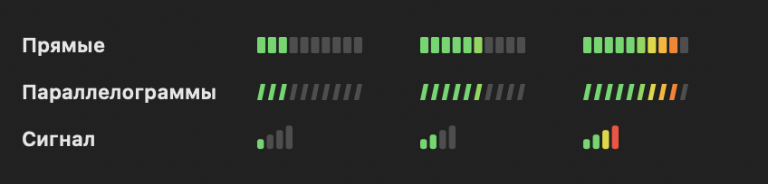

# ClaudeBar

Лимиты подписки **Claude** (Pro/Max) прямо в менюбаре Mac.<br>
Седьмой инструмент семейства: Pomodoro → TempBar → BreakBar → NetBar → RadioBar → NoteBar.



## Что показывает

В менюбаре — компактно, две строки со шкалой загрузки:

```
5ч ▰▰▰▱▱▱▱▱▱▱ 32%
7д ▰▰▰▰▱▱▱▱▱▱ 37%
```

- **5ч** — 5-часовое окно сессии (то, что чаще всего упираешься)
- **7д** — недельный лимит по всем моделям

Шкала заливается по загрузке **зелёный → жёлтый → оранжевый → красный**.
Проценты при подходе к лимиту подсвечиваются: **оранжевый ≥ 80%**, **красный ≥ 95%**.

### Форма шкалы (на выбор)



- **Прямые** — прямые блоки
- **Параллелограммы** — со скосом, как `▰▱` в терминале (по умолчанию)
- **Сигнал** — 4 растущих столбика, как индикатор сети на iPhone

По клику — панель с LED-шкалами (красная стрелка-игла — фирменная фишка семейства):

- Сессия · 5 часов + таймер до сброса
- Неделя · все модели + таймер до сброса
- Недельный лимит по конкретной модели (если активен, напр. Fable)
- Бейдж подписки (MAX) в углу

## Откуда данные

Недокументированный эндпоинт `GET https://api.anthropic.com/api/oauth/usage`
(ровно то, что показывает `/usage` внутри Claude Code). OAuth-токен подписки
берётся из Keychain (item `Claude Code-credentials`) — тот же, что использует
Claude Code. Ничего вводить не нужно.

Опрос раз в 180 секунд (обязательный `User-Agent: claude-code/*`, иначе 429).
При открытии панели — подтягивает свежее (троттлинг 60 сек).

> Эндпоинт неофициальный, может измениться без предупреждения. Токен обновляет
> сам Claude Code; если он давно не запускался и токен истёк — в баре `Claude ⚠`.

## Установка

```bash
./install.sh
```

Собирает из исходников, кладёт в `~/Applications/ClaudeBar.app`, ставит
автозапуск (LaunchAgent `ru.lebedev.claudebar`). Пересборка после правок —
`./build.sh`.

## Правый клик (настройки)

- **Форма шкалы** — Прямые / Параллелограммы / Сигнал
- **Окна** — 5ч и 7д / Только 5ч / Только 7д
- **Монохром** — убрать цвет (белые шкалы)
- **Подпись 5ч / 7д** — скрыть/показать подписи
- **Проценты** — скрыть/показать проценты
- **Обновить сейчас** (`r`)
- **Выход** (`q`)

## Превью (dev)

```bash
swiftc -O -o /tmp/ClaudeBar ClaudeBar.swift
/tmp/ClaudeBar --panel  out.png dark    # панель (light|dark)
/tmp/ClaudeBar --shapes out.png dark    # все формы шкалы
```

## Структура

- `ClaudeBar.swift` — всё приложение (Cocoa, один файл)
- `makeicon.swift` — генератор иконки (датчик-манометр в цвете Claude clay)
- `install.sh` / `build.sh` — установка и пересборка
- `assets/` — превью панели и иконка
